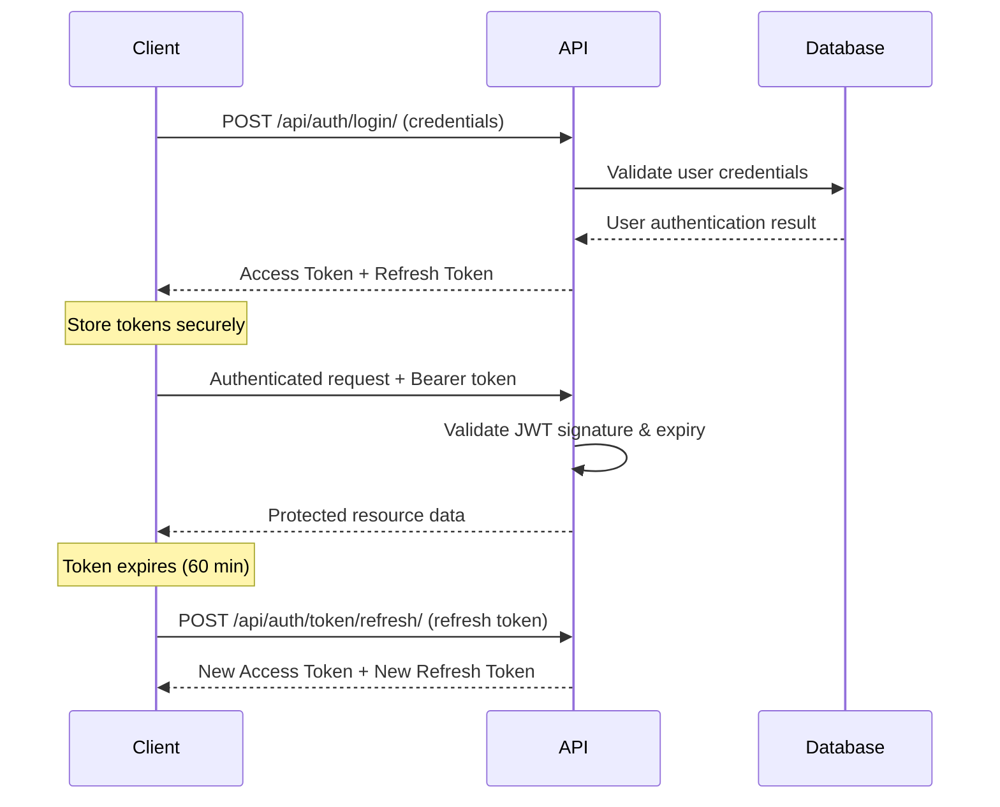

# 🏗️ Recruitment Platform - Architecture Documentation

## Table of Contents
1. [API Structure & Design Decisions](#api-structure--design-decisions)
2. [Authentication Flow & Security](#authentication-flow--security)
3. [Error Management & Validation](#error-management--validation)
4. [Scaling & Production Considerations](#scaling--production-considerations)
5. [Performance Optimization](#performance-optimization)
6. [Security Best Practices](#security-best-practices)

---

## API Structure & Design Decisions

### RESTful Design Philosophy

Our API follows REST architectural principles with clear resource-based URLs and appropriate HTTP methods.

#### Resource Mapping
```
User Authentication:
POST   /api/auth/register/        # Create new user account
POST   /api/auth/login/           # Authenticate user
POST   /api/auth/logout/          # Invalidate user session
POST   /api/auth/token/refresh/   # Refresh JWT tokens

User Profile Management:
GET    /api/profile/              # Retrieve user profile
PATCH  /api/profile/              # Update user profile (partial)
GET    /api/user-info/            # Get current user basic info
```

#### Design Decisions Rationale

**1. URL Structure**
- **Nested Resources**: `/api/auth/*` groups authentication endpoints logically
- **Singular vs Plural**: Using singular `/profile/` since it's user-specific (one profile per user)
- **Versioning**: `/api/` prefix allows for future versioning (`/api/v2/`)

**2. HTTP Methods**
- **POST** for authentication: Follows security best practices (credentials in body)
- **PATCH** for profile updates: Allows partial updates without requiring full object
- **GET** for data retrieval: Idempotent operations

**3. Response Format Standards**
```json
// Success Response
{
  "success": true,
  "data": { /* resource data */ },
  "message": "Operation completed successfully"
}

// Error Response  
{
  "success": false,
  "error": {
    "code": "VALIDATION_ERROR",
    "message": "Invalid input provided",
    "details": {
      "field_name": ["Specific error message"]
    }
  }
}
```

**4. Status Code Strategy**
- `200 OK`: Successful GET/PATCH operations
- `201 Created`: Successful POST operations (user registration)
- `400 Bad Request`: Client validation errors
- `401 Unauthorized`: Authentication required/failed
- `403 Forbidden`: Insufficient permissions
- `404 Not Found`: Resource doesn't exist
- `500 Internal Server Error`: Server-side errors

---

## Authentication Flow & Security

### JWT Authentication Architecture

#### Token Lifecycle Flow


#### Security Implementation Details

**1. Token Configuration**
```python
SIMPLE_JWT = {
    'ACCESS_TOKEN_LIFETIME': timedelta(minutes=60),    # Short-lived for security
    'REFRESH_TOKEN_LIFETIME': timedelta(days=1),       # Longer for UX
    'ROTATE_REFRESH_TOKENS': True,                     # Generate new refresh token
    'BLACKLIST_AFTER_ROTATION': True,                 # Invalidate old tokens
    'ALGORITHM': 'HS256',                              # Secure signing algorithm
    'SIGNING_KEY': SECRET_KEY,                         # Django secret key
}
```

**2. Password Security**
- **Hashing**: Django's PBKDF2 with SHA256 (industry standard)
- **Validation**: Multiple validators prevent weak passwords
- **Minimum Length**: 8 characters required
- **Complexity**: Prevents common passwords and user attribute similarity

**3. CORS Security**
```python
CORS_ALLOWED_ORIGINS = [
    "http://localhost:3000",   # Development only
    "http://localhost:5173",   # Vite dev server
]
CORS_ALLOW_CREDENTIALS = True  # Allow cookies/auth headers
```

**4. Authentication Headers**
```
Authorization: Bearer <access_token>
Content-Type: application/json
```

#### Frontend Token Management

**1. Secure Storage**
```javascript
// tokens stored in memory (AuthContext)
// Automatic refresh on API calls
// Logout clears all tokens
```

**2. Automatic Token Refresh**
```javascript
// Axios interceptor detects 401 responses
// Attempts token refresh before retrying original request
// Redirects to login if refresh fails
```

---

## Error Management & Validation

### Validation Strategy

#### Multi-Layer Validation Architecture
```
1. Frontend Validation (UX)
   ↓ Real-time feedback
2. API Serializer Validation (Security)
   ↓ Server-side verification  
3. Database Constraints (Data Integrity)
   ↓ Final safety net
```

#### Frontend Validation
```javascript
// Real-time validation in React components
const [errors, setErrors] = useState({});

const validateField = (name, value) => {
  switch (name) {
    case 'email':
      return /^[^\s@]+@[^\s@]+\.[^\s@]+$/.test(value) 
        ? '' : 'Invalid email format';
    case 'password':
      return value.length >= 8 
        ? '' : 'Password must be at least 8 characters';
    default:
      return '';
  }
};
```

#### Backend Validation (Django Serializers)
```python
class UserRegistrationSerializer(serializers.ModelSerializer):
    password = serializers.CharField(write_only=True, min_length=8)
    password_confirm = serializers.CharField(write_only=True)

    def validate(self, attrs):
        # Cross-field validation
        if attrs['password'] != attrs['password_confirm']:
            raise serializers.ValidationError("Passwords don't match")
        return attrs

    def validate_email(self, value):
        # Unique email validation
        if User.objects.filter(email=value).exists():
            raise serializers.ValidationError(
                "A user with this email already exists."
            )
        return value
```

### Error Response Patterns

#### Validation Errors (400 Bad Request)
```json
{
  "success": false,
  "error": {
    "code": "VALIDATION_ERROR",
    "message": "Invalid input provided",
    "details": {
      "email": ["A user with this email already exists."],
      "password": ["This field is required."]
    }
  }
}
```

#### Authentication Errors (401 Unauthorized)
```json
{
  "success": false,
  "error": {
    "code": "AUTHENTICATION_FAILED",
    "message": "Invalid credentials",
    "details": null
  }
}
```

#### Server Errors (500 Internal Server Error)
```json
{
  "success": false,
  "error": {
    "code": "INTERNAL_ERROR",
    "message": "An unexpected error occurred",
    "details": null
  }
}
```

### Frontend Error Handling

#### Global Error Handling
```javascript
// Axios response interceptor
api.interceptors.response.use(
  (response) => response,
  (error) => {
    if (error.response?.status === 401) {
      // Handle authentication errors
      logout();
      navigate('/login');
    } else if (error.response?.status >= 500) {
      // Handle server errors
      showNotification('Server error. Please try again later.');
    }
    return Promise.reject(error);
  }
);
```

#### Component-Level Error States
```javascript
const [error, setError] = useState('');
const [loading, setLoading] = useState(false);

try {
  setLoading(true);
  await api.post('/api/auth/login/', credentials);
  navigate('/profile');
} catch (err) {
  setError(err.response?.data?.error?.message || 'Login failed');
} finally {
  setLoading(false);
}
```

---

## Scaling & Production Considerations

### Database Scaling Strategy

#### Current Architecture (Development)
```
SQLite Database
├── Single file storage
├── No concurrent writes
└── Perfect for prototyping
```

#### Production Database Migration Path
```
Phase 1: PostgreSQL Migration
├── ACID compliance
├── Concurrent connections
├── JSON field support
└── Full-text search capabilities

Phase 2: Read Replicas
├── Master-slave configuration
├── Read queries → Replica
├── Write queries → Master
└── Load distribution

Phase 3: Database Sharding (High Scale)
├── User-based sharding
├── Geographic distribution
└── Microservice databases
```

#### Database Configuration for Production
```python
DATABASES = {
    'default': {
        'ENGINE': 'django.db.backends.postgresql',
        'NAME': 'recruitment_platform',
        'USER': 'postgres',
        'PASSWORD': os.environ.get('DB_PASSWORD'),
        'HOST': 'localhost',
        'PORT': '5432',
        'OPTIONS': {
            'MAX_CONNS': 20,
            'CONN_MAX_AGE': 300,
        }
    }
}
```

### Application Scaling Architecture

#### Phase 1: Vertical Scaling (Single Server)
```
Load Balancer (Nginx)
├── Static File Serving
├── SSL Termination
└── Rate Limiting

Django Application Server
├── Gunicorn WSGI Server
├── Multiple Worker Processes
└── Process Management

Background Tasks
├── Celery Task Queue
├── Redis Message Broker
└── Async Processing
```

#### Phase 2: Horizontal Scaling (Multiple Servers)
```
Load Balancer
├── Round-robin distribution
├── Health check monitoring
└── Session affinity

Application Servers (Multiple)
├── Stateless design
├── Shared session storage
└── Auto-scaling groups

Microservices Architecture
├── User Service
├── Profile Service
├── Notification Service
└── File Upload Service
```

#### Phase 3: Cloud-Native Architecture
```
Container Orchestration (Kubernetes)
├── Pod auto-scaling
├── Service discovery
├── Rolling deployments
└── Health monitoring

Managed Services
├── AWS RDS (Database)
├── AWS S3 (File Storage)
├── AWS SQS (Message Queue)
└── AWS CloudFront (CDN)
```

### Caching Strategy

#### Redis Caching Implementation
```python
# Cache user profiles for faster access
CACHES = {
    'default': {
        'BACKEND': 'django_redis.cache.RedisCache',
        'LOCATION': 'redis://127.0.0.1:6379/1',
        'OPTIONS': {
            'CLIENT_CLASS': 'django_redis.client.DefaultClient',
        }
    }
}

# Cache user profile data
@cache_page(60 * 15)  # 15 minutes
def get_user_profile(request):
    # Profile data cached for performance
    pass
```

#### Frontend Caching
```javascript
// React Query for API response caching
import { useQuery } from 'react-query';

const { data: profile, isLoading } = useQuery(
  'userProfile',
  fetchUserProfile,
  {
    staleTime: 5 * 60 * 1000, // 5 minutes
    cacheTime: 10 * 60 * 1000, // 10 minutes
  }
);
```

### CDN & Static Asset Strategy

#### Production Static File Serving
```python
# Django Settings
STATIC_URL = 'https://cdn.yourplatform.com/static/'
MEDIA_URL = 'https://cdn.yourplatform.com/media/'

# AWS S3 Configuration
DEFAULT_FILE_STORAGE = 'storages.backends.s3boto3.S3Boto3Storage'
STATICFILES_STORAGE = 'storages.backends.s3boto3.StaticS3Boto3Storage'
```

---

## Performance Optimization

### Database Optimization

#### Query Optimization Strategies
```python
# Use select_related for ForeignKey relationships
profile = UserProfile.objects.select_related('user').get(id=user_id)

# Use prefetch_related for reverse relationships
profiles = UserProfile.objects.prefetch_related('user__groups').all()

# Database indexing for frequently queried fields
class UserProfile(models.Model):
    email = models.EmailField(db_index=True)  # Index for fast lookups
    created_at = models.DateTimeField(auto_now_add=True, db_index=True)
```

#### Database Connection Pooling
```python
# Production database configuration
DATABASES = {
    'default': {
        'ENGINE': 'django.db.backends.postgresql',
        'OPTIONS': {
            'MAX_CONNS': 20,
            'CONN_MAX_AGE': 300,  # Connection reuse
        }
    }
}
```

### Frontend Performance

#### Code Splitting & Lazy Loading
```javascript
// Lazy load components for better initial load time
const UserProfile = lazy(() => import('./components/UserProfile'));
const Login = lazy(() => import('./components/Login'));

// Route-based code splitting
const AppRoutes = () => (
  <Suspense fallback={<LoadingSpinner />}>
    <Routes>
      <Route path="/profile" element={<UserProfile />} />
      <Route path="/login" element={<Login />} />
    </Routes>
  </Suspense>
);
```

#### Image & Asset Optimization
```javascript
// Optimized image loading
const ProfilePicture = ({ src, alt }) => (
  
);
```

---

## Security Best Practices

### Production Security Checklist

#### Django Security Settings
```python
# Production security configuration
DEBUG = False
ALLOWED_HOSTS = ['yourplatform.com', 'www.yourplatform.com']

# Security middleware
MIDDLEWARE = [
    'django.middleware.security.SecurityMiddleware',
    'django.middleware.csrf.CsrfViewMiddleware',
    # ... other middleware
]

# Security headers
SECURE_BROWSER_XSS_FILTER = True
SECURE_CONTENT_TYPE_NOSNIFF = True
SECURE_HSTS_SECONDS = 31536000
SECURE_HSTS_INCLUDE_SUBDOMAINS = True
SECURE_HSTS_PRELOAD = True
```

#### Input Sanitization
```python
# Automatic protection via Django ORM
# Manual sanitization for raw queries
from django.utils.html import escape

def sanitize_input(user_input):
    return escape(user_input)
```

#### File Upload Security
```python
# Secure file upload configuration
MEDIA_ROOT = '/secure/media/path/'
FILE_UPLOAD_MAX_MEMORY_SIZE = 5242880  # 5MB
FILE_UPLOAD_PERMISSIONS = 0o644

# File type validation
def validate_file_extension(value):
    allowed_extensions = ['.pdf', '.doc', '.docx']
    ext = os.path.splitext(value.name)[1]
    if ext.lower() not in allowed_extensions:
        raise ValidationError('Unsupported file extension.')
```

### API Security

#### Rate Limiting
```python
# Django REST Framework throttling
REST_FRAMEWORK = {
    'DEFAULT_THROTTLE_CLASSES': [
        'rest_framework.throttling.AnonRateThrottle',
        'rest_framework.throttling.UserRateThrottle'
    ],
    'DEFAULT_THROTTLE_RATES': {
        'anon': '100/hour',
        'user': '1000/hour'
    }
}
```

#### CORS Security
```python
# Restrictive CORS for production
CORS_ALLOWED_ORIGINS = [
    "https://yourplatform.com",
    "https://www.yourplatform.com",
]
CORS_ALLOW_CREDENTIALS = True
CORS_EXPOSE_HEADERS = ['Content-Length', 'X-CSRFToken']
```

---

## Deployment Architecture

### Production Deployment Pipeline

#### CI/CD Pipeline
```yaml
# GitHub Actions example
name: Deploy to Production
on:
  push:
    branches: [main]

jobs:
  test:
    runs-on: ubuntu-latest
    steps:
      - name: Run Tests
        run: |
          python manage.py test
          npm test
  
  deploy:
    needs: test
    runs-on: ubuntu-latest
    steps:
      - name: Deploy to AWS
        run: |
          # Deployment commands
```

#### Infrastructure as Code
```yaml
# Docker Compose for production
version: '3.8'
services:
  web:
    build: .
    ports:
      - "8000:8000"
    environment:
      - DATABASE_URL=postgresql://user:pass@db:5432/recruitment
    depends_on:
      - db
      - redis
  
  db:
    image: postgres:13
    environment:
      - POSTGRES_DB=recruitment
      - POSTGRES_USER=postgres
      - POSTGRES_PASSWORD=password
  
  redis:
    image: redis:6
    
  nginx:
    image: nginx
    ports:
      - "80:80"
      - "443:443"
    depends_on:
      - web
```

### Monitoring & Logging

#### Application Monitoring
```python
# Django logging configuration
LOGGING = {
    'version': 1,
    'disable_existing_loggers': False,
    'handlers': {
        'file': {
            'level': 'INFO',
            'class': 'logging.FileHandler',
            'filename': '/var/log/django/recruitment.log',
        },
    },
    'loggers': {
        'django': {
            'handlers': ['file'],
            'level': 'INFO',
            'propagate': True,
        },
    },
}
```

#### Performance Monitoring
- **Application Performance**: New Relic, DataDog
- **Database Monitoring**: PgAnalyze for PostgreSQL
- **Infrastructure**: CloudWatch, Prometheus
- **Error Tracking**: Sentry for real-time error monitoring

---

## Future Architecture Considerations

### Microservices Migration Path

#### Service Decomposition Strategy
```
Monolith → Modular Monolith → Microservices

Phase 1: Extract Services
├── User Service (Authentication)
├── Profile Service (User Data)
├── File Service (Uploads)
└── Notification Service (Emails)

Phase 2: Event-Driven Architecture
├── Message Bus (Apache Kafka)
├── Event Sourcing
└── CQRS Pattern
```

#### API Gateway Implementation
```
API Gateway (Kong/AWS API Gateway)
├── Request routing
├── Authentication
├── Rate limiting
├── API versioning
└── Monitoring
```

### Advanced Features Architecture

#### Real-time Features
```
WebSocket Implementation
├── Django Channels
├── Redis Channel Layer
├── Real-time notifications
└── Live chat support
```

#### Search & Analytics
```
Elasticsearch Integration
├── Full-text search
├── Advanced filtering
├── Search analytics
└── Auto-suggestions
```

#### Machine Learning Integration
```
ML Pipeline
├── User recommendation engine
├── Job matching algorithms
├── Resume parsing
└── Skill extraction
```

---

This architectural documentation provides the foundation for scaling the recruitment platform from a prototype to a production-ready, enterprise-grade application. Each section includes specific implementation details and can be extended as the platform grows.
