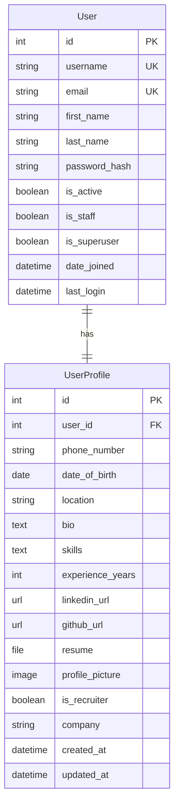

# 🗄️ Database Schema Documentation

## Overview

The Recruitment Platform uses a relational database design with Django ORM. This document provides comprehensive details about the database structure, relationships, and design decisions.

**Database Engine**: SQLite (Development) / PostgreSQL (Production)  
**ORM**: Django ORM with automatic migrations  
**Character Set**: UTF-8

---

## Database Diagram



---

## Table Definitions

### django_user (Built-in Django User Model)

**Purpose**: Core user authentication and basic user information

| Field | Type | Constraints | Description |
|-------|------|-------------|-------------|
| `id` | Integer | PRIMARY KEY, AUTO_INCREMENT | Unique user identifier |
| `username` | VARCHAR(150) | UNIQUE, NOT NULL | Unique username for login |
| `email` | VARCHAR(254) | UNIQUE, NOT NULL | User's email address |
| `first_name` | VARCHAR(150) | NULL | User's first name |
| `last_name` | VARCHAR(150) | NULL | User's last name |
| `password` | VARCHAR(128) | NOT NULL | Hashed password (PBKDF2-SHA256) |
| `is_active` | Boolean | DEFAULT TRUE | Account active status |
| `is_staff` | Boolean | DEFAULT FALSE | Admin access flag |
| `is_superuser` | Boolean | DEFAULT FALSE | Superuser privileges |
| `date_joined` | DateTime | DEFAULT NOW | Account creation timestamp |
| `last_login` | DateTime | NULL | Last successful login |

#### Indexes
- `UNIQUE INDEX` on `username`
- `UNIQUE INDEX` on `email`
- `INDEX` on `is_active`

#### Password Security
- **Algorithm**: PBKDF2-SHA256
- **Salt**: Random 12-character salt per password
- **Iterations**: 320,000+ (Django default, increases over time)

---

### Platform_userprofile

**Purpose**: Extended user profile information for recruitment features

| Field | Type | Constraints | Description |
|-------|------|-------------|-------------|
| `id` | Integer | PRIMARY KEY, AUTO_INCREMENT | Profile identifier |
| `user_id` | Integer | FOREIGN KEY, UNIQUE, NOT NULL | Reference to User.id |
| `phone_number` | VARCHAR(15) | NULL | User's phone number |
| `date_of_birth` | Date | NULL | User's birth date |
| `location` | VARCHAR(100) | NULL | User's location/city |
| `bio` | Text | NULL, MAX 500 chars | User's biography |
| `skills` | Text | NULL | Comma-separated skills list |
| `experience_years` | Integer | DEFAULT 0 | Years of experience |
| `linkedin_url` | URL | NULL | LinkedIn profile URL |
| `github_url` | URL | NULL | GitHub profile URL |
| `resume` | FileField | NULL | Uploaded resume file |
| `profile_picture` | ImageField | NULL | Profile picture upload |
| `is_recruiter` | Boolean | DEFAULT FALSE | Recruiter account flag |
| `company` | VARCHAR(100) | NULL | Company name (for recruiters) |
| `created_at` | DateTime | DEFAULT NOW | Profile creation time |
| `updated_at` | DateTime | AUTO UPDATE | Last modification time |

#### Indexes
- `UNIQUE INDEX` on `user_id`
- `INDEX` on `is_recruiter`
- `INDEX` on `created_at`
- `INDEX` on `experience_years`

#### File Storage
- **Resume uploads**: `media/resumes/`
- **Profile pictures**: `media/profile_pics/`
- **Max file size**: 5MB (configurable)
- **Allowed formats**: 
  - Resume: PDF, DOC, DOCX
  - Images: JPG, PNG, GIF

---

## Relationships

### User ↔ UserProfile (One-to-One)

```python
# Django Model Relationship
class UserProfile(models.Model):
    user = models.OneToOneField(User, on_delete=models.CASCADE)
    # other fields...
```

**Relationship Details:**
- **Type**: One-to-One
- **Cascade**: DELETE CASCADE (deleting user removes profile)
- **Creation**: Automatic via Django signals when User is created
- **Access**: `user.userprofile` or `profile.user`

#### Signal Implementation
```python
@receiver(post_save, sender=User)
def create_user_profile(sender, instance, created, **kwargs):
    if created:
        UserProfile.objects.create(user=instance)

@receiver(post_save, sender=User)
def save_user_profile(sender, instance, **kwargs):
    instance.userprofile.save()
```

---

## Database Constraints & Validation

### Field Constraints

#### User Model Constraints
```sql
-- Username constraints
ALTER TABLE auth_user ADD CONSTRAINT username_unique UNIQUE (username);
ALTER TABLE auth_user ADD CONSTRAINT username_not_empty CHECK (username != '');

-- Email constraints  
ALTER TABLE auth_user ADD CONSTRAINT email_unique UNIQUE (email);
ALTER TABLE auth_user ADD CONSTRAINT email_format CHECK (email LIKE '%@%');

-- Password constraints
ALTER TABLE auth_user ADD CONSTRAINT password_not_empty CHECK (password != '');
```

#### UserProfile Model Constraints
```sql
-- Phone number format
ALTER TABLE Platform_userprofile 
ADD CONSTRAINT phone_format CHECK (phone_number REGEXP '^[+]?[0-9\s\-\(\)]{10,15}$');

-- Experience years range
ALTER TABLE Platform_userprofile 
ADD CONSTRAINT experience_range CHECK (experience_years >= 0 AND experience_years <= 100);

-- URL format validation (handled by Django)
-- Bio length limit (handled by Django CharField max_length)
```

### Application-Level Validation

#### Django Model Validation
```python
class UserProfile(models.Model):
    phone_number = models.CharField(
        max_length=15, 
        blank=True, 
        null=True,
        validators=[RegexValidator(r'^[+]?[0-9\s\-\(\)]{10,15}$')]
    )
    
    bio = models.TextField(
        max_length=500, 
        blank=True, 
        null=True,
        help_text="Brief description (max 500 characters)"
    )
    
    experience_years = models.IntegerField(
        default=0,
        validators=[MinValueValidator(0), MaxValueValidator(100)]
    )
```

---

## Data Types & Storage

### Text Fields
- **VARCHAR fields**: Use UTF-8 encoding
- **TEXT fields**: Support full Unicode character set
- **URLs**: Validated format with protocol requirement

### File Fields
- **Storage backend**: Local filesystem (development), AWS S3 (production)
- **Path structure**: `media/{field_name}/{year}/{month}/{day}/filename`
- **Security**: File type validation, size limits, virus scanning (production)

### DateTime Fields
- **Timezone**: UTC storage, localized display
- **Auto fields**: `auto_now_add` for creation, `auto_now` for updates
- **Format**: ISO 8601 standard

---

## Performance Considerations

### Query Optimization

#### Common Query Patterns
```python
# Efficient profile retrieval with user data
profile = UserProfile.objects.select_related('user').get(user_id=user_id)

# Bulk profile queries
profiles = UserProfile.objects.select_related('user').filter(is_recruiter=True)

# Search optimization
profiles = UserProfile.objects.filter(
    skills__icontains='python',
    experience_years__gte=3
).select_related('user')
```

#### Database Indexes Strategy
```sql
-- Composite indexes for common queries
CREATE INDEX idx_userprofile_recruiter_experience 
ON Platform_userprofile(is_recruiter, experience_years);

CREATE INDEX idx_userprofile_location_skills 
ON Platform_userprofile(location, skills);

-- Full-text search index (PostgreSQL)
CREATE INDEX idx_userprofile_skills_fulltext 
ON Platform_userprofile USING gin(to_tsvector('english', skills));
```

### Connection Management
```python
# Production database configuration
DATABASES = {
    'default': {
        'ENGINE': 'django.db.backends.postgresql',
        'OPTIONS': {
            'MAX_CONNS': 20,
            'CONN_MAX_AGE': 300,  # Connection pooling
        }
    }
}
```

---

## Migration Strategy

### Migration Files Overview
```
migrations/
├── 0001_initial.py          # Initial UserProfile model
├── 0002_add_resume_field.py # Resume upload functionality
├── 0003_add_indexes.py      # Performance indexes
└── 0004_add_constraints.py  # Data integrity constraints
```

### Safe Migration Practices
```python
# Example: Adding nullable field first
class Migration(migrations.Migration):
    operations = [
        migrations.AddField(
            model_name='userprofile',
            name='new_field',
            field=models.CharField(max_length=100, null=True, blank=True),
        ),
    ]

# Later migration: Add constraint after data population
class Migration(migrations.Migration):
    operations = [
        migrations.AlterField(
            model_name='userprofile',
            name='new_field',
            field=models.CharField(max_length=100, null=False, default=''),
        ),
    ]
```

---

## Backup & Recovery

### Backup Strategy
```bash
# Development backup (SQLite)
cp db.sqlite3 backups/db_$(date +%Y%m%d_%H%M%S).sqlite3

# Production backup (PostgreSQL)
pg_dump -h localhost -U postgres recruitment_platform > \
  backups/recruitment_$(date +%Y%m%d_%H%M%S).sql
```

### Data Export/Import
```python
# Django management commands
python manage.py dumpdata Platform.UserProfile > userprofiles.json
python manage.py loaddata userprofiles.json

# Specific model backup
python manage.py dumpdata auth.User Platform.UserProfile --format=json \
  --indent=2 > full_backup.json
```

---

## Security Considerations

### Data Protection
- **PII Encryption**: Sensitive fields encrypted at rest (production)
- **Access Control**: Row-level security for multi-tenant scenarios
- **Audit Trail**: Change tracking for profile modifications

### File Upload Security
```python
def validate_file_extension(value):
    allowed_extensions = ['.pdf', '.doc', '.docx']
    ext = os.path.splitext(value.name)[1]
    if ext.lower() not in allowed_extensions:
        raise ValidationError('Unsupported file extension.')

class UserProfile(models.Model):
    resume = models.FileField(
        upload_to='resumes/',
        validators=[validate_file_extension],
        blank=True,
        null=True
    )
```

---

## Future Schema Enhancements

### Planned Extensions

#### Job Posting System
```python
class JobPosting(models.Model):
    recruiter = models.ForeignKey(UserProfile, on_delete=models.CASCADE)
    title = models.CharField(max_length=200)
    description = models.TextField()
    requirements = models.TextField()
    salary_range = models.CharField(max_length=100)
    location = models.CharField(max_length=100)
    created_at = models.DateTimeField(auto_now_add=True)
    is_active = models.BooleanField(default=True)
```

#### Application Tracking
```python
class JobApplication(models.Model):
    job = models.ForeignKey(JobPosting, on_delete=models.CASCADE)
    applicant = models.ForeignKey(UserProfile, on_delete=models.CASCADE)
    status = models.CharField(max_length=50, choices=APPLICATION_STATUSES)
    applied_at = models.DateTimeField(auto_now_add=True)
    cover_letter = models.TextField(blank=True, null=True)
```

#### Skills Taxonomy
```python
class Skill(models.Model):
    name = models.CharField(max_length=100, unique=True)
    category = models.CharField(max_length=50)
    
class UserSkill(models.Model):
    user_profile = models.ForeignKey(UserProfile, on_delete=models.CASCADE)
    skill = models.ForeignKey(Skill, on_delete=models.CASCADE)
    proficiency_level = models.IntegerField(choices=PROFICIENCY_LEVELS)
```

---

## Database Maintenance

### Regular Maintenance Tasks
```sql
-- Analyze table statistics
ANALYZE TABLE Platform_userprofile;

-- Optimize table storage
OPTIMIZE TABLE Platform_userprofile;

-- Check for orphaned records
SELECT * FROM Platform_userprofile 
WHERE user_id NOT IN (SELECT id FROM auth_user);
```

### Monitoring Queries
```sql
-- Active user profiles
SELECT COUNT(*) FROM Platform_userprofile p
JOIN auth_user u ON p.user_id = u.id
WHERE u.is_active = true;

-- Recruiter distribution
SELECT is_recruiter, COUNT(*) as count
FROM Platform_userprofile
GROUP BY is_recruiter;

-- Profile completion rate
SELECT 
  AVG(CASE WHEN phone_number IS NOT NULL THEN 1 ELSE 0 END) * 100 as phone_completion,
  AVG(CASE WHEN bio IS NOT NULL THEN 1 ELSE 0 END) * 100 as bio_completion,
  AVG(CASE WHEN skills IS NOT NULL THEN 1 ELSE 0 END) * 100 as skills_completion
FROM Platform_userprofile;
```

---

This database schema documentation provides a comprehensive foundation for understanding the data structure of the Recruitment Platform. The schema is designed to be scalable and can accommodate future recruitment-specific features while maintaining data integrity and performance.
